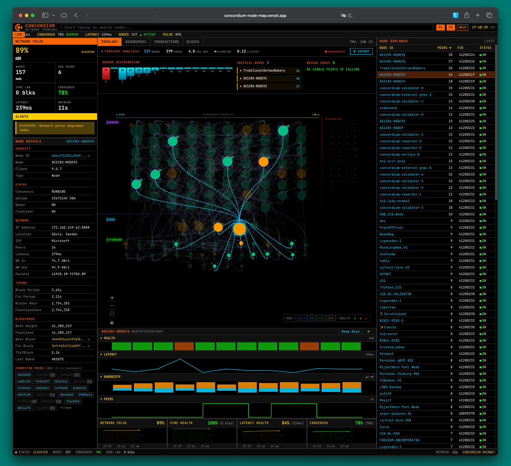
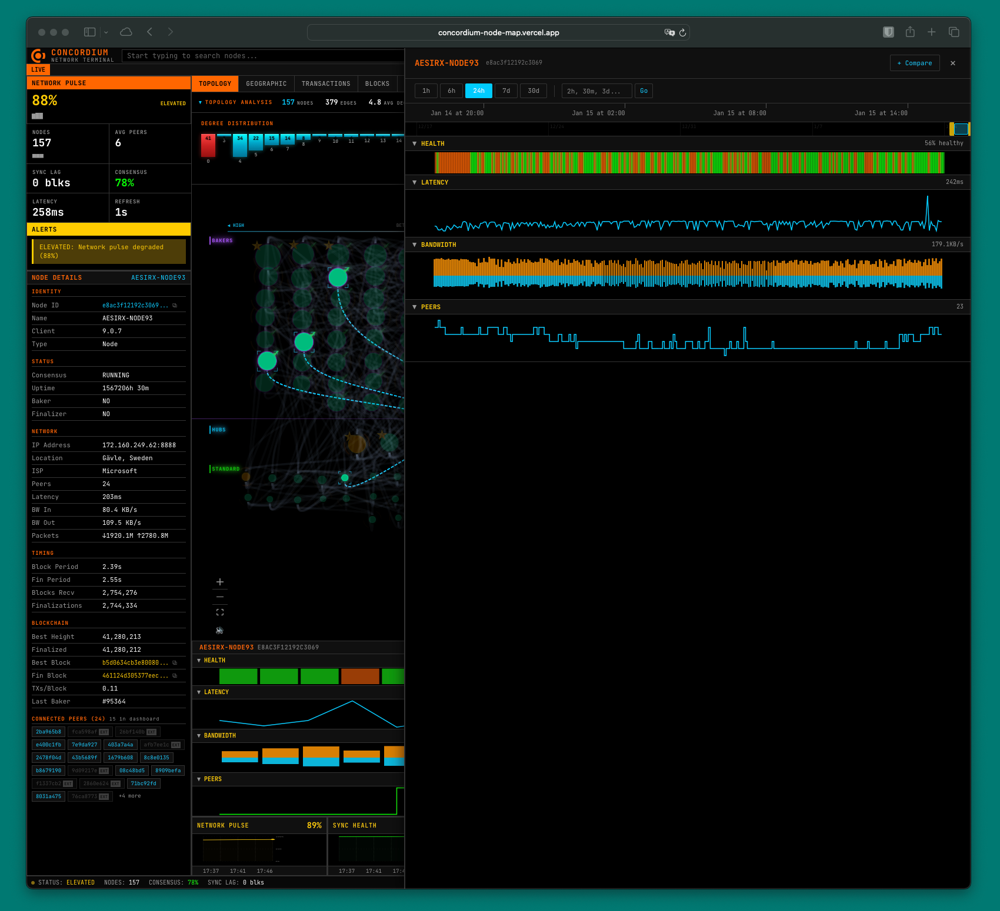
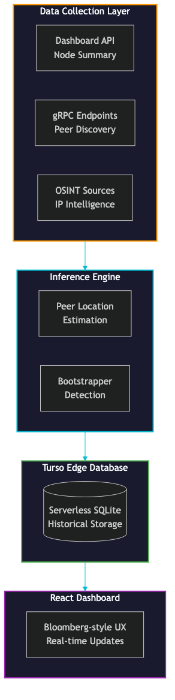

| | |
|---|---|
| **To:** | CTO, Head of Engineering |
| **From:** | Concordium Security Team |
| **Subject:** | Network Visibility Platform |
| **Classification:** | Internal |

\vspace{-0.3cm}

## See It Live: [https://concordium-node-map.vercel.app](https://concordium-node-map.vercel.app)

\vspace{-0.2cm}

{ width=85% }

\newpage

{ width=90% }

\newpage

## Executive Summary

The **Concordium Node Map** is a proprietary real-time monitoring and intelligence platform developed by the Concordium Security Team to provide unprecedented visibility into blockchain network health, validator operations, and peer topology.

**Key Outcome:** Proactive detection of network degradation, consensus failures, and validator health issues before they impact chain finalization.

---

## Strategic Context: Internal Security Investigations

Following internal security investigations by the Concordium Security Team, **validator health assurance** emerged as a critical operational requirement:

- Network health depends on ≥67% validator consensus (ConcordiumBFT quorum threshold)
- No existing monitoring solution provided protocol-aware health metrics
- Validator uptime, peer connectivity, and finalization lag require continuous tracking

**Gap Identified:** Off-the-shelf APM tools (Datadog, Grafana, Prometheus) lack blockchain protocol awareness.

---

## Why Custom Development Was Required

| Requirement | Off-the-Shelf | Node Map |
|-------------|---------------|----------|
| ConcordiumBFT quorum tracking | Not supported | Native 67% alerting |
| Finalization lag measurement | Generic latency | Protocol-aware sync lag |
| Peer topology discovery | Static config | gRPC live discovery |
| Validator identification | No blockchain context | Tier classification |
| Geographic distribution | Manual mapping | Automated GeoIP |
| Network Pulse score | N/A | Weighted health algorithm |

\newpage

## System Capabilities

### 1. Real-Time Network Pulse

Proprietary composite health score (0-100%):

- **Finalization Health** (40%) — Block finalization lag
- **Latency Health** (30%) — Network round-trip performance
- **Consensus Health** (30%) — Validators running consensus

**Thresholds:** NOMINAL (90-100%) | DEGRADED (67-74%) | CRITICAL (<67%)

### 2. Topology Intelligence

- Live network graph showing peer relationships
- Automatic bottleneck and bridge node detection
- Validator (Baker) tier classification

### 3. OSINT Integration

- Automated IP reputation lookups via InternetDB
- Vulnerability scanning for node infrastructure

### 4. Historical Trending

- 15-60 minute sliding window analytics
- Per-node performance history

---

## Technical Architecture

{ width=75% }

**Deployment:** Vercel serverless + Turso edge database | **Update:** 5-min polling, 30-sec UI refresh

\newpage

## Value Delivered

| Metric | Before | After |
|--------|--------|-------|
| Time to detect degradation | Hours (manual) | **< 5 minutes** |
| Validator health visibility | None | **100% coverage** |
| Topology understanding | Unknown | **Full peer graph** |
| Geographic insight | Unknown | **Mapped to region** |
| Historical analysis | Not possible | **Up to 60 minutes** |

---

## Risk Mitigation

Addresses audit-identified risks:

1. **Consensus Failure Prevention** — Real-time quorum monitoring
2. **Validator Accountability** — Individual baker tracking
3. **Infrastructure Security** — OSINT flags vulnerable nodes
4. **Incident Response** — Historical data for root cause analysis

---

## Investment Summary

| Component | Status |
|-----------|--------|
| R&D Investment | Completed in-house |
| Operational Cost | Minimal (serverless, free OSINT) |
| Maintenance | Low (automated, self-healing) |
| Dependencies | Concordium gRPC SDK, public APIs |

---

## Recommendation

Continue investment — this platform provides **irreplaceable operational visibility** that cannot be achieved through commercial alternatives. Internal security investigations underscored validator health as a critical security control — this system delivers that control.

**Next Steps:** (1) Slack/PagerDuty alerting (2) Extended historical retention (3) Testnet implementation

---

*Concordium Security Team — R&D Division | January 2026*
